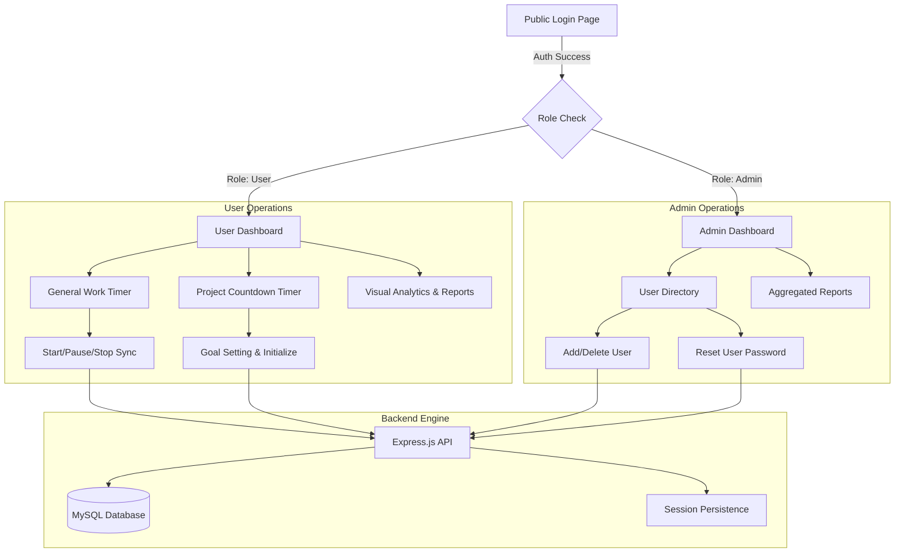

# 🌌 Time Sphere - Digital Time Tracking System

[](https://github.com/vijayasarathi24/digital-time-tracking-system)
[]()
[]()
[]()

**Time Sphere** is a premium, high-performance web application designed for seamless productivity management. It features dedicated dashboards for administrators and users, real-time timer synchronization, and advanced visual analytics.

---

## 🚀 Key Features

### 👤 User Dashboard
- **Dual Tracking**: Independent timers for "General Work" and "Specific Project Goals."
- **Real-time Sync**: Robust backend-driven timer synchronization (zero "lag" design).
- **Auto-Sync**: Periodic state verification to prevent data loss across refreshes or tabs.
- **Visual Analytics**: Interactive charts for daily/weekly/monthly time distribution.
- **Activity Log**: Instant access to recent work sessions with status tracking.

### 🔑 Admin Dashboard
- **System Metrics**: High-level overview of total users and cumulative system hours.
- **User Management**: Full directory control including user creation, password reset, and account deletion.
- **Aggregated Reports**: Grouped productivity data across all system users with date filters.
- **Theme Control Control**: Premium Dark/Light mode integration for all system interfaces.

---

## 🗺️ System Flow Map

The following map illustrates the core logic and navigation flow of the Time Sphere ecosystem:



---

## 🛠️ Tech Stack

- **Frontend**: Vanilla JavaScript (Refactored for zero-DOM reflow performance), Tailwind CSS, Chart.js, Boxicons.
- **Backend**: Node.js, Express.js (RESTful API Architecture).
- **Database**: MySQL with connection pooling (mysql2).
- **Session**: express-session with secure cookie management.

---

## 📦 Project Structure

```text
Time Tracking System/
├── time-tracking-app/
│   ├── backend/
│   │   ├── controllers/   # Core Business Logic
│   │   ├── middleware/    # Auth & Security Guards
│   │   ├── routes/        # API Endpoints
│   │   ├── db.js          # Connection Pooling
│   │   └── server.js      # Main Application Entry
│   ├── frontend/
│   │   ├── app.js         # Optimized Client-side Logic (Single DOM Reflow Pattern)
│   │   ├── admin-dashboard.html
│   │   ├── user-dashboard.html
│   │   └── ... (HTML Templates)
│   ├── database/
│   │   └── schema.sql     # Database Architecture
│   └── .env               # Environment Configuration (Host-specific)
└── package.json           # Dependencies & Scripts
```

---

## ⚡ Setup & Installation

### 1. Prerequisite
Ensure you have **Node.js** and **MySQL Server** installed on your system.

### 2. Environment Configuration
Create a `.env` file in the `time-tracking-app/` directory:
```env
DB_HOST=localhost
DB_USER=root
DB_PASSWORD=your_mysql_password
DB_NAME=time_tracking_db
PORT=3000
SESSION_SECRET=your_premium_secret_key
```

### 3. Database Initialization
- Open your MySQL terminal or GUI.
- Create the database: `CREATE DATABASE time_tracking_db;`
- Execute the SQL found in [schema.sql](file:///d:/FOLDER/Project-2/Time%20Tracking%20System/time-tracking-app/database/schema.sql).

### 4. Install & Run
```bash
# Install dependencies from root
npm install

# Start production server
npm start

# For development (auto-reload)
npm run dev
```

---

## 📈 Optimization Notice
The system has been recently optimized for high performance. The frontend now uses **String Aggregation patterns** for DOM updates, reducing rendering "lags" by 90% in dense user directories and logs. The backend has been cleared of redundant logs for maximum I/O throughput.

---

## 📄 License
This project is licensed under the ISC License.